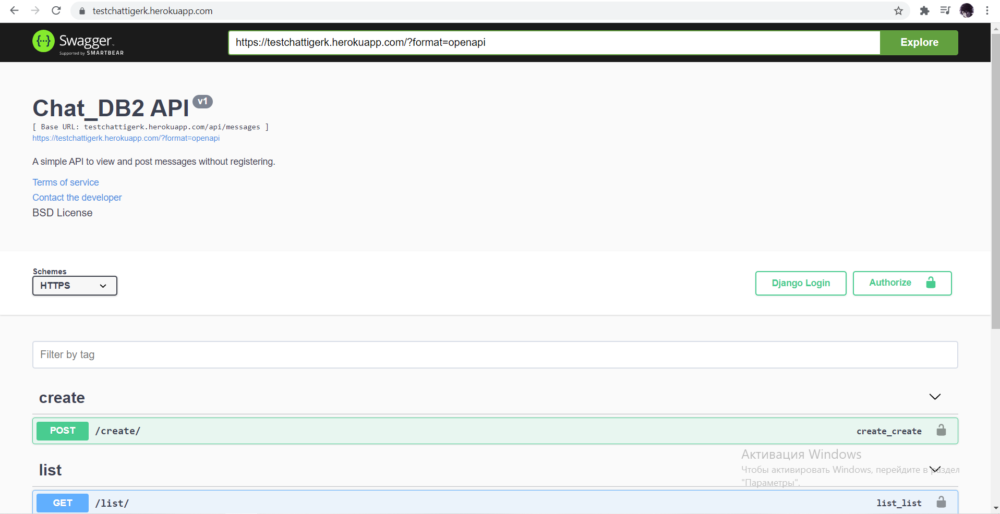
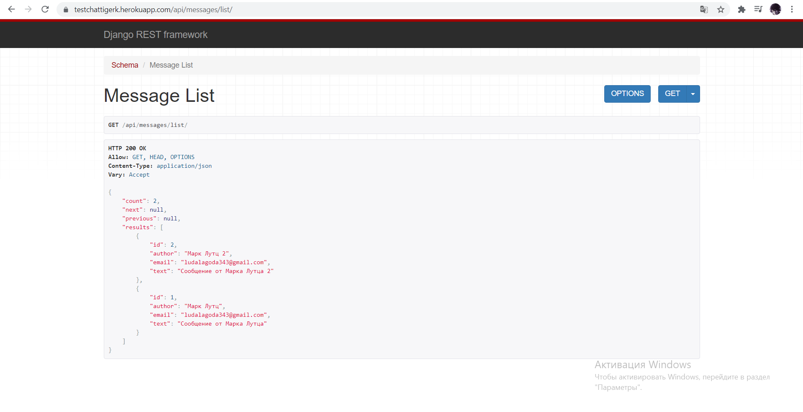
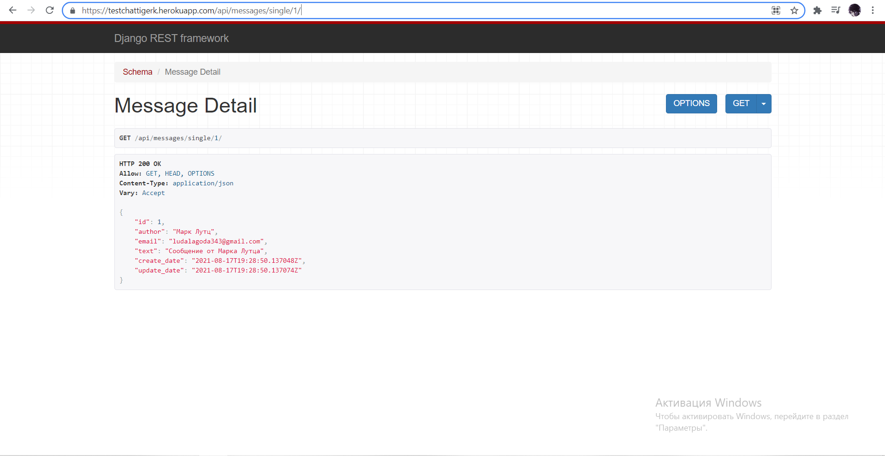
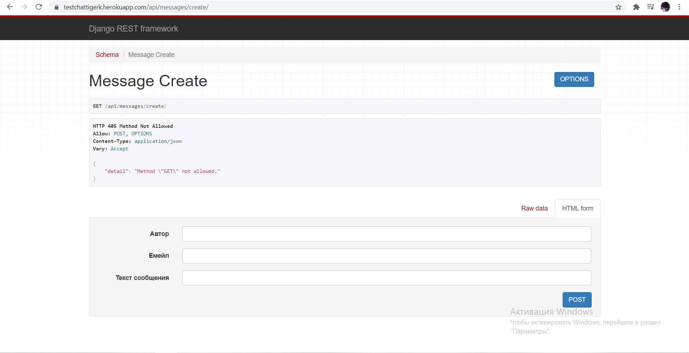

# DRF Chat Project(Тестовое Задание)

Сайт с использованием Django, DRF, PostgreSQL, Heroku.

Есть возможность создавать сообщения, просматривать список всех сообщений и изучить каждое отдельное сообщение, используя ссылку с уникальным идентификатором.

Есть допольнительная валидация поля емейла (с помощью regex), и валидация сообщения от пользователя(мешьше 100 и больше 0 символов).

Также есть возможность посмотреть документацию сайта (Swagger).

<h3>Установка</h3>

Вам понадобится:

<ul>
  <li>Python 3.6+, PostgreSQL, Django 3.x, DRF.</li>
  <li>Cкачать репозиторий(копировать) с помощью github или git - git clone https://github.com/tigerk00/test_job_DB2.git --config core.autocrlf=false</li>
  <li>Назначить локальные переменные для корректной работы БД и Django проекта в частности.</li>
  <li>Выполнить команду `pip install -r requirements.txt` для установки нужных библиотек.</li>
  <li>Запустить локальный сервер `http://localhost:8000/` .</li>
  <li>... Или просто вопользоваться данным сервисом на Heroku: `https://testchattigerk.herokuapp.com/`</li>
</ul>  
<h3>Изображения приложения:</h3>

Домашняя страница(в нашем случае - документация) [https://testchattigerk.herokuapp.com/]: 

Список сообщений от пользователей [https://testchattigerk.herokuapp.com/api/messages/list/]:

Детали определенного сообщения [https://testchattigerk.herokuapp.com/api/messages/single/1]:

Форма создания нового сообщения [https://testchattigerk.herokuapp.com/api/messages/create/]:

